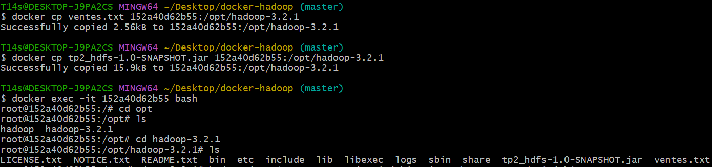
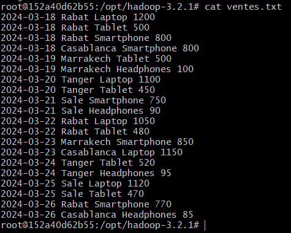
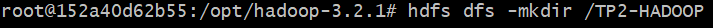
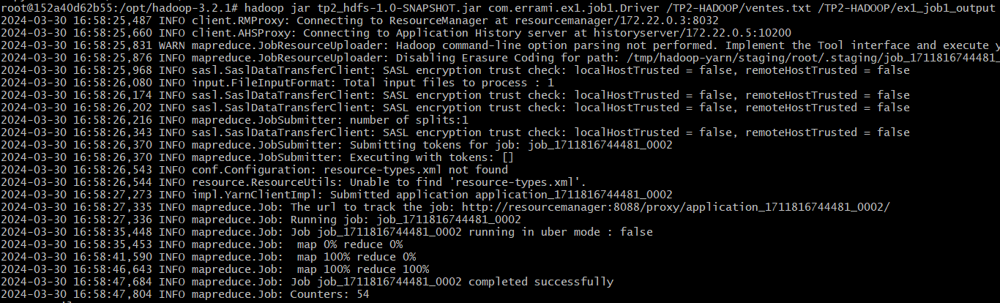
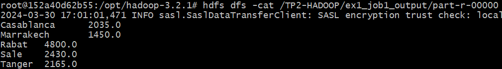
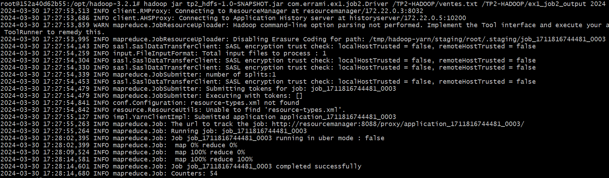
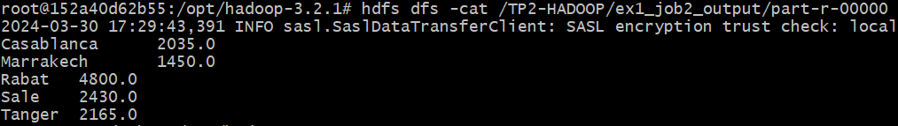
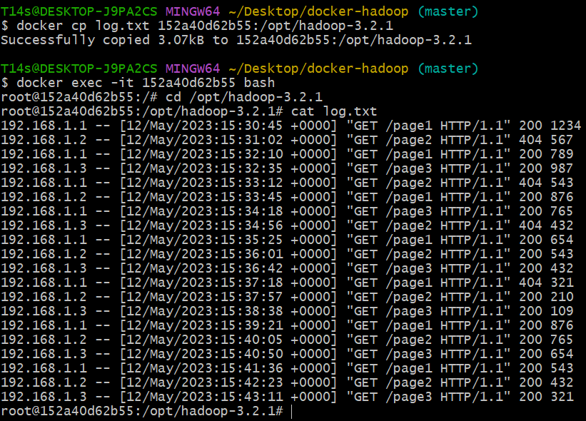
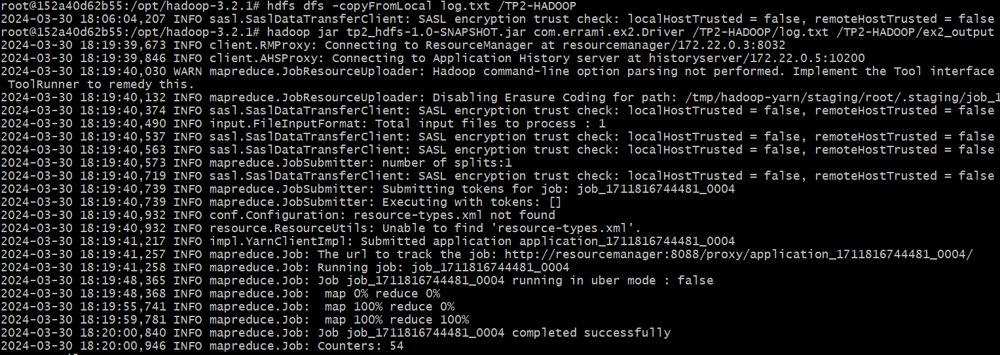
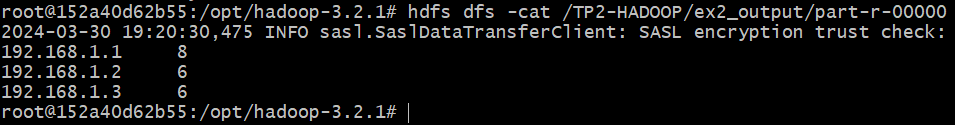

# Hadoop MapReduce

## Introduction

Ce projet est un exemple d'utilisation de Hadoop MapReduce pour traiter des données massives. Il contient deux exercices :

## Structure du projet

```
   src
    ├───main
    │   ├───java
    │   │   └───com
    │   │       └───errami
    │   │           ├───ex1
    │   │           │   ├───job1
    │   │           │   │       Driver.java
    │   │           │   │       JobMapper.java
    │   │           │   │       JobReducer.java
    │   │           │   │
    │   │           │   └───job2
    │   │           │           Driver.java
    │   │           │           JobMapper.java
    │   │           │           JobReducer.java
    │   │           │
    │   │           ├───ex2
    │   │           │       Driver.java
    │   │           │       JobMapper.java
    │   │           │       JobReducer.java
    │   │           │
    │   │           └───word_counting
    │   │                   WordCountDriver.java
    │   │                   WordCountMapper.java
    │   │                   WordCountReducer.java
    │   │
    │   └───resources
    └───test
        └───java
```

## Exercice 1 : Traitement de données de vente

### Objectif

Analyser un ensemble de données de ventes stockées dans un fichier texte par calculer le total des ventes par ville à partir de ce fichier. Chaque ligne du fichier contient des informations sur une vente, y compris la date, la ville, le produit et le prix. Les données sont stockées dans le format suivant :

```
date ville produit prix
```

### Travail à faire

1. Développer un job MapReduce pour calculer le total des ventes par ville.
2. Développer un deuxième job pour calculer le prix total des ventes des produits par ville pour une année donnée.

### La tâche 1

1. Code source du Driver

```java
public class Driver {
    public static void main(String[] args) throws Exception {
        Configuration conf = new Configuration();
        Job job = Job.getInstance(conf);
        job.setJarByClass(Driver.class);
        job.setMapperClass(JobMapper.class);
        job.setReducerClass(JobReduce.class);
        job.setOutputKeyClass(Text.class);
        job.setOutputValueClass(DoubleWritable.class);
        job.setInputFormatClass(TextInputFormat.class);
        FileInputFormat.addInputPath(job, new Path(args[0]));
        FileOutputFormat.setOutputPath(job, new Path(args[1]));
        System.exit(job.waitForCompletion(true) ? 0 : 1);
    }
}

```

2. Code source du Mapper

```java
public class JobMapper extends Mapper<LongWritable, Text,Text,DoubleWritable> {
    @Override
    protected void map(LongWritable key, Text value, Mapper<LongWritable, Text, Text, DoubleWritable>.Context context) throws IOException, InterruptedException {
        String[] tokens = value.toString().split(" ");
        if (tokens.length == 4) {
            String city = tokens[1];
            double price = Double.parseDouble(tokens[3]);
            context.write(new Text(city), new DoubleWritable(price));
        }
    }
}
```

3. Code source du Reducer

```java
public class JobReducer extends Reducer<Text, DoubleWritable,Text,DoubleWritable> {
    @Override
    protected void reduce(Text key, Iterable<DoubleWritable> values, Reducer<Text, DoubleWritable, Text, DoubleWritable>.Context context) throws IOException, InterruptedException {
        double totalSales = 0.0;
        for (DoubleWritable value : values) {
            totalSales += value.get();
        }
        context.write(key, new DoubleWritable(totalSales));
    }
}
```



4. Test avec une list des ventes



5. Execution

```
hadoop jar tp2_hdfs-1.0-SNAPSHOT.jar com.errami.ex1.job1.Driver /TP2-HADOOP/ventes.txt /TP2-HADOOP/ex1_job1_output
```





6. Résultats



### La tâche 2

1. Code source du Driver

```java
public class Driver {
   public static void main(String[] args) throws Exception {
      Configuration conf = new Configuration();
      Job job = Job.getInstance(conf);

      job.setJarByClass(Driver.class);
      job.setMapperClass(JobMapper.class);
      job.setReducerClass(JobReducer.class);

      job.setOutputKeyClass(Text.class);
      job.setOutputValueClass(DoubleWritable.class);

      job.setInputFormatClass(TextInputFormat.class);

      FileInputFormat.addInputPath(job, new Path(args[0]));
      FileOutputFormat.setOutputPath(job, new Path(args[1]));

      job.waitForCompletion(true);
   }
}
```

2. Code source du Mapper

```java
public class JobMapper extends Mapper<LongWritable, Text, Text, DoubleWritable> {
   @Override
   protected void map(LongWritable key, Text value, Mapper<LongWritable, Text, Text, DoubleWritable>.Context context) throws IOException, InterruptedException {
      String[] tokens = value.toString().split(" ");
      if (tokens.length == 4) {
         String city = tokens[1];
         double price = Double.parseDouble(tokens[3]);
         context.write(new Text(city), new DoubleWritable(price));
      }
   }
}
```

3. Code source du Reducer

```java
public class JobReducer extends Reducer<Text, DoubleWritable, Text, DoubleWritable> {
   @Override
   protected void reduce(Text key, Iterable<DoubleWritable> values, Reducer<Text, DoubleWritable, Text, DoubleWritable>.Context context) throws IOException, InterruptedException {
      double totalSales = 0.0;
      for (DoubleWritable value : values) {
         totalSales += value.get();
      }
      context.write(key, new DoubleWritable(totalSales));
   }
}
```

4. Test avec une list des ventes


5. Execution (Avec l'année 2024 comme paramètre)

```
hadoop jar tp2_hdfs-1.0-SNAPSHOT.jar com.errami.ex1.job2.Driver /TP2-HADOOP/ventes.txt /TP2-HADOOP/ex1_job2_output 2024
```



6. Résultats




## Exercice 2 : Analyse des fichiers journaux Web

### Objectif
Analyser un fichier journal Web pour compter le nombre total de requêtes et le nombre de requêtes réussies (code de réponse HTTP 200) par adresse IP. Chaque ligne du fichier journal contient des informations sur une requête, y compris l'adresse IP, la date, la méthode HTTP, l'URL, le code de réponse et d'autres informations.

### Travail à faire
Utiliser Hadoop MapReduce pour calculer le nombre total de requêtes et le nombre de requêtes réussies (code de réponse HTTP 200) par adresse IP.

1. Source code du Driver
```java
public class Driver {
    public static void main(String[] args) throws Exception {
        Configuration conf = new Configuration();
        Job job = Job.getInstance(conf);
        job.setJarByClass(Driver.class);
        job.setMapperClass(JobMapper.class);
        job.setReducerClass(JobReducer.class);
        job.setOutputKeyClass(Text.class);
        job.setOutputValueClass(IntWritable.class);
        job.setInputFormatClass(TextInputFormat.class);
        FileInputFormat.addInputPath(job, new Path(args[0]));
        FileOutputFormat.setOutputPath(job, new Path(args[1]));
        System.exit(job.waitForCompletion(true) ? 0 : 1);
    }
}
```

2. Source code du Mapper
```java
public class JobMapper extends Mapper<LongWritable, Text, Text, IntWritable> {
    @Override
    protected void map(LongWritable key, Text value, Mapper<LongWritable, Text, Text, IntWritable>.Context context) throws IOException, InterruptedException {
        String word = value.toString();
        String[] informations = word.split(" ");
        String ipAdd = informations[0].split(" -- ")[0];
        context.write(new Text(ipAdd),new IntWritable(1));
    }
}
```

3. Source code du Reducer
```java
public class JobReducer extends Reducer<Text, IntWritable, Text, IntWritable> {
    @Override
    protected void reduce(Text key, Iterable<IntWritable> values, Reducer<Text, IntWritable, Text, IntWritable>.Context context) throws IOException, InterruptedException {
        int counter=0;
        Iterator<IntWritable> iterator = values.iterator();
        while (iterator.hasNext()){
            counter+=iterator.next().get();
        }
        context.write(key,new IntWritable(counter));
    }
}
```

4. Test avec un fichier log



5. Execution 

```
hadoop jar tp2_hdfs-1.0-SNAPSHOT.jar com.errami.ex2.Driver /TP2-HADOOP/log.txt /TP2-HADOOP/ex2_output
```



6. Résultats (Le nombre de requêtes réussies)


